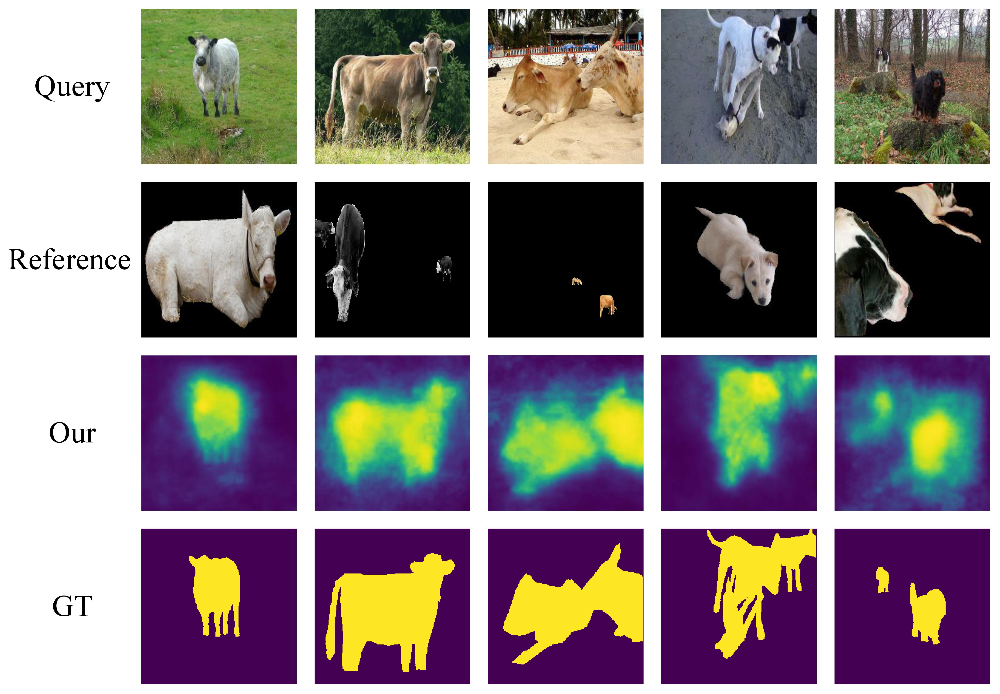
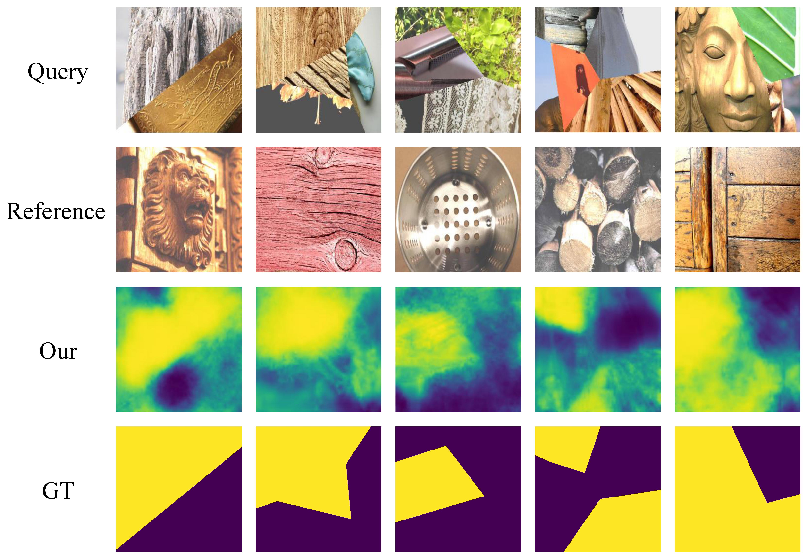

  Figure 1: Some qualitative results of our model on PASCAL-5 datasets.

|method|i=0|i=1|i=2|i=3|mean|
--|--|--|--|--|--|
OSLSM|33.6|55.3|40.9|33.5|40.8
ours|37.2|50.2|41.8|35.1|41.1

  Table 1 : Our comparison with other methods on the PASCAL-5 datasets in terms of mean IoU. The setting of experiment is 
  the same as our paper.

  Figure 2: Some qualitative results of our model on FMD datasets.

| Method      | IoU     | 
:-:|:-:|
| OSTC     | 0.216     |
| OSLSM     | 0.326     |
| ours     | 0.357     |

  Table 2 : Our comparison with other methods on the FMD datasets in terms of mean IoU. The setting of experiment is the same as our paper.

